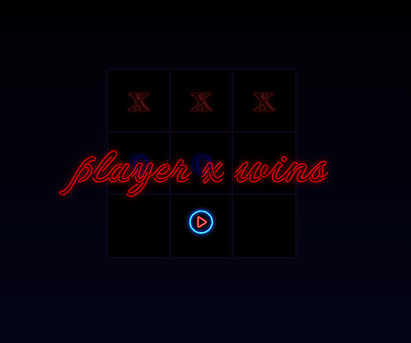

# Tic Tac Toe

A web-based Tic Tac Toe game built using HTML, CSS, and JavaScript.
The application enables two players to play alternately with real-time UI updates, automatic win detection, and reset functionality.

---

## Overview

This project implements the classic Tic Tac Toe game with an interactive and responsive interface. It provides immediate visual feedback for player actions and efficiently determines game outcomes, including wins and ties.

---

## Preview



---

## Features

* Two-player gameplay (X and O)
* Turn-based interaction with visual indicators
* Automatic win detection across all possible combinations
* Tie detection when all cells are filled
* Overlay display indicating winner or tie result
* Reset functionality to restart the game
* Dynamic UI styling based on player turns

---

## Technologies Used

* HTML5
* CSS3
* JavaScript (ES6)
* jQuery

---

## Project Structure

```
tic-tac-toe/
│── index.html
│── style.css
│── script.js
│── images/
│   ├── screenshot.png
│   └── replayicon.jpg
│── README.md
```

---

## Usage

1. Open `index.html` in a web browser
2. Click on any empty cell to make a move
3. Players alternate turns (X starts first)
4. The game automatically detects a winner or tie
5. Use the reset button to start a new game

---

## Key Concepts Applied

* DOM manipulation
* Event handling
* Conditional logic
* Game state management
* Dynamic UI updates using CSS classes

---

## Live Demo

*(To be added using GitHub Pages)*

---

## Possible Improvements

* Optimize win-check logic to reduce repetition
* Implement single-player mode with basic AI
* Improve responsiveness for mobile devices
* Add score tracking across multiple rounds
* Enhance UI/UX with animations and transitions

---

## Author

* RITHUSHRI V A

---

## Notes

This project was developed as part of practicing frontend development fundamentals, focusing on JavaScript logic, event handling, and interactive UI design.
